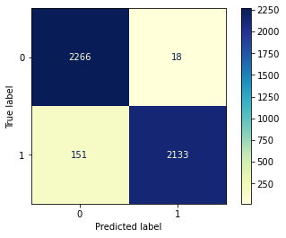

# SyriaTel Communications Customer Retention

## Overview
Flatiron School Data Science Phase 3 project.  Focusing on classification.

## Business Problem
Syria Telcom is looking to lower its churn rate.  Being able to retain customers is essential in the competive telecommunications industry.  

## Data Used
data from the following sources can be found in the 'data' folder

data/telcom.csv

## Metric - Recall
We are primarily concerned with Recall in this situation.  Getting as many of the churned customers identified is very important.

False Negatives are the primary concern with Recall.  Getting this as low as possible was the goal.  Due to the nature of the problem it will be very challenging to get all the churns identified withot have a ton of False Positives.

While False Positives are not our primary concern, too many false positives will add additional costs that may negate the savings made by identifying the churned customers.
## Iterative Modeling process
### Recall Comparison

## Final Model
The final model was a Random Forest Classifier with hyper-tuned parameters.

## Confusion Matrix

## Feature Importance

## Deliverables
* [Non-Technical Presentation](/pdf/non-tech-pres-syria-telcom-cflynn.pdf)
* [GitHub Repository](https://github.com/ceflynn/Phase-3-Syria_Telcom)
* [Jupyter Notebook](https://github.com/ceflynn/Phase-3-Syria_Telcom/blob/main/student2.ipynb)

